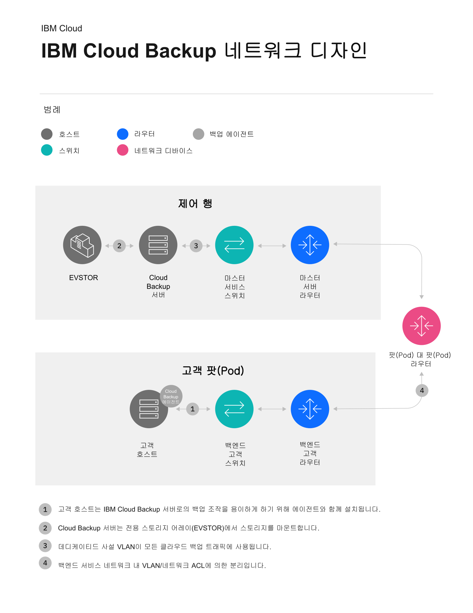

---

copyright:
  years: 1994, 2019
lastupdated: "2019-04-15"

keywords: IBM Cloud backup, EVault, Carbonite, backup, port information, configure, configuring, network information, network diagram

subcollection: Backup

---
{:new_window: target="_blank"}
{:tip: .tip}
{:note: .note}
{:important: .important}
{:DomainName: data-hd-keyref="APPDomain"}
{:DomainName: data-hd-keyref="DomainName"}

# {{site.data.keyword.backup_notm}} 네트워크 디자인
{: #network-diagram}

